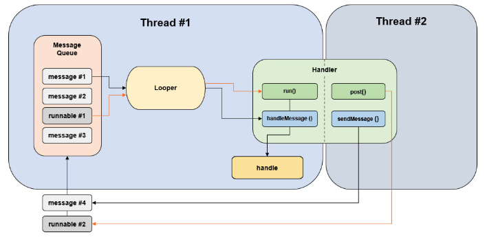
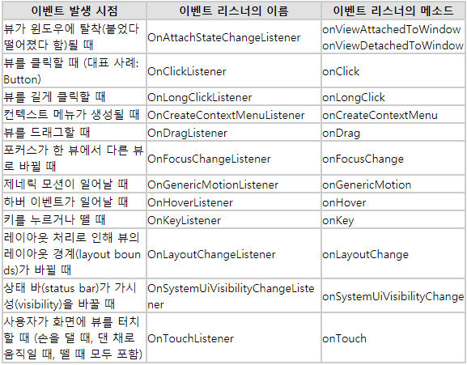

# webNapp QnA

👻 <br>
안드로이드와 웹을 공부하면서 궁금한 것들을 정리합니다.

- recent updates : 2020-09-09

---
## 목차

### 1. 안드로이드 📱

  
  <details>
    <summary> 
      Activity vs AppCompatActivity and Context
    </summary>
  
  * Activity
    - __정의__ <br>
    _사용자에게 UI가 있는 화면을 제공_ 하는 앱 컴포넌트. <br><br>
    각 액티비티는 다른 액티비티를 실행할 수 있고, <br>
    새로운 액티비티가 시작되면 시스템은 '백스택'에 담고, 사용자에게 보여준다. <br>
    백스택은 '스택(LIFO)' 매커니즘을 따르며, 사용자가 뒤로가기 버튼을 누를 경우, <br>
    스택의 최상위(top)에 있는 현재 액티비티를 제거(pop and destroy)하고 이전의 액티비티를 시작한다.
    
    - __Activity 생명주기(LifeCycle)__

    

      - `OnCreate()` <br>
      이 콜백은 시스템이 먼저 활동을 생성할 때 실행되는 것으로, 필수적으로 구현해야 한다. <br>
      활동이 생성되면 생성됨 상태가 된다. onCreate() 메서드에서 활동의 전체 수명 주기 동안 한 번만 발생해야 하는 기본 애플리케이션 시작 로직을 실행한다. <br>
      예를 들어 onCreate()를 구현하면 데이터를 목록에 바인딩하고, 활동을 ViewModel과 연결하고, 일부 클래스 범위 변수를 인스턴스화할 수도 있다.<br>
      이 메서드는 savedInstanceState 매개변수를 수신하는데, 이는 활동의 이전 저장 상태가 포함된 Bundle 객체다.<br>
      이번에 처음 생성된 활동인 경우 Bundle 객체의 값은 null이다.<br>

        ```java

        String str;

        @Override
        public void onCreate(Bundle savedInstanceState) {
            super.onCreate(savedInstanceState);

            // 인스턴스 상태 복구
            if (savedInstanceState != null) {
                str = savedInstanceState.getString(STATE_KEY);
            }

            setContentView(R.layout.main_activity);

            ...
        }
        ```
        onCreate() 메서드가 실행을 완료하면 시작됨 상태가 되고, 시스템이 연달아 onStart()와 onResume() 메서드를 호출한다.<br><br>

      - `OnStart()` <br>
      활동이 시작됨 상태에 들어가면 시스템은 이 콜백을 한다.<br>
      onStart()가 호출되면 활동이 사용자에게 표시되고, 이 메서드에서 앱이 UI를 관리하는 코드를 초기화한다.<br><br>
      onStart() 메서드는 매우 빠르게 완료되고, 생성됨 상태와 마찬가지로 활동은 시작됨 상태에 머무르지 않는다.<br>
      이 콜백이 완료되면 활동이 재개됨 상태에 들어가고, 시스템이 onResume() 메서드를 호출한다.<br><br>

      - `OnResume()` <br>
      활동이 재개됨 상태에 들어가면 포그라운드에 표시되고 시스템이 onResume() 콜백을 호출한다.<br>
      이 상태에 들어갔을 때 앱이 사용자와 상호작용한다. 어떤 이벤트가 발생하여 앱에서 포커스가 떠날 때까지 앱이 이 상태에 머무른다.<br> 예를 들어 전화가 오거나, 사용자가 다른 활동으로 이동하거나, 기기 화면이 꺼지는 이벤트가 이에 해당한다.<br><br>
      방해되는 이벤트가 발생하면 활동은 일시중지됨 상태에 들어가고, 시스템이 onPause() 콜백을 호출한다.<br><br>

      - `OnPause()` <br>
      시스템은 사용자가 활동을 떠나는 것을 나타내는 첫 번째 신호로 이 메서드를 호출한다.(하지만 해당 활동이 항상 소멸되는 것은 아님)<br> 활동이 포그라운드에 있지 않게 되었다는 것을 나타낸다(다만 사용자가 멀티 윈도우 모드에 있을 경우에는 여전히 표시 될 수도 있음).<br><br>
      onPause() 메서드의 실행이 완료되더라도 활동이 일시중지됨 상태로 남아 있을 수 있다.<br> 오히려 활동은 다시 시작되거나 사용자에게 완전히 보이지 않게 될 때까지 이 상태에 머무른다.<br>
      활동이 다시 시작되면 시스템은 다시 한번 onResume() 콜백을 호출한다. <br>
      활동이 일시중지됨 상태에서 재개됨 상태로 돌아오면 시스템은 Activity 인스턴스를 메모리에 남겨두고, 시스템이 onResume()을 호출할 때 인스턴스를 다시 호출한다. 이 시나리오에서는 최상위 상태가 재개됨 상태인 콜백 메서드 중에 생성된 구성요소는 다시 초기화할 필요가 없다. 활동이 완전히 보이지 않게 되면 시스템은 onStop()을 호출한다. 
      
      - `OnStop()` <br>
      활동이 사용자에게 더 이상 표시되지 않으면 중단됨 상태에 들어가고, 시스템은 onStop() 콜백을 호출한다. <br>
      이는 예를 들어 새로 시작된 활동이 화면 전체를 차지할 경우에 적용된다. 시스템은 활동의 실행이 완료되어 종료될 시점에 onStop()을 호출할 수도 있다.<br><br>
      onPause() 대신 onStop()을 사용하면 사용자가 멀티 윈도우 모드에서 활동을 보고 있더라도 UI 관련 작업이 계속 진행됩니다.<br>
      또한 onStop()을 사용하여 CPU를 비교적 많이 소모하는 종료 작업을 실행해야 한다. 예를 들어 정보를 데이터베이스에 저장할 적절한 시기를 찾지 못했다면 onStop() 상태일 때 저장할 수 있다.<br><br>
      활동은 정지됨 상태에서 다시 시작되어 사용자와 상호작용하거나, 실행을 종료하고 사라진다.<br>
      활동이 다시 시작되면 시스템은 onRestart()를 호출한다. Activity가 실행을 종료하면 시스템은 onDestroy()를 호출한다. 

      - `OnDestory()` <br>
      onDestroy()는 활동이 소멸되기 전에 호출된다. 시스템은 다음 중 하나에 해당할 때 이 콜백을 호출한다.<br>

        1) (사용자가 활동을 완전히 닫거나 활동에서 finish()가 호출되어) 활동이 종료되는 경우
        2) 구성 변경(예: 기기 회전 또는 멀티 윈도우 모드)으로 인해 시스템이 일시적으로 활동을 소멸시키는 경우<br>
      활동이 종료되는 경우 onDestroy()는 활동이 수신하는 마지막 수명 주기 콜백이 된다.<br>
      구성 변경으로 인해 onDestroy()가 호출되는 경우 시스템이 즉시 새 활동 인스턴스를 생성한 다음, 새로운 구성에서 그 새로운 인스턴스에 관해 onCreate()를 호출한다.<br><br>
      onDestroy() 콜백은 이전의 콜백에서 아직 해제되지 않은 모든 리소스(예: onStop())를 해제해야 한다.<br><br>  

  * AppCompatActivity
    - __정의__ <br>
      안드로이드의 하위버전을 지원하는 액티비티이다. <br><br>
      하위버전 메소드가 실행이 안될 때 지를 지원하기 위해 AppCompatActivity를 사용하며,<br>
      ActionBar 역시 하위 버전 단말기에서는 이 액티비티를 사용해야 한다.<br><br>

  * Context
    - __정의__ <br>
      안드로이드 시스템에서 제공하는 추상 클래스이다.<br>
      새로 생성된 객체가 지금 어떤 일이 일어나고 있는지 알 수 있도록 한다. 따라서 액티비티와 애플리케이션에 대한 정보를 얻기 위해서는 컨텍스트를 사용하면 된다.

    - __Application Context__ <br>
      애플리케이션 컨텍스트는 싱글턴 인스턴스이며 액티비티에서 getApplicationContext()를 통해 접근할 수 있다.<br>
      이 컨텍스트는 애플리케이션의 라이프사이클과 연결되어 있다. 애플리케이션 컨텍스트는 현재의 컨텍스트와 분리된 라이프사이클을 가진 컨텍스트가 필요할 때나 액티비티의 범위를 넘어서 컨텍스트를 전달할 떄에 사용한다.

    - __Activity Context__ <br>
      액티비티 컨텍스트는 액티비티에서 사용 가능하며 이 컨텍스트는 액티비티의 라이프사이클과 연결되어 있다. 액티비티의 범위 내에서 컨텍스트를 전달하거나, 라이프사이클이 현재의 컨텍스트에 붙은 컨텍스트가 필요할 때(need the context whose lifecycle is attached to the current context) 액티비티 컨텍스트를 사용한다.<br><br>  
  
  [Top of page](#목차)
  </details>

  <details>
    <summary> 
      AsyncTask 
    </summary>
    
  - __정의__ <br>
    쓰레드, 메시지루프 등의 원리를 이해하지 않아도 `하나의 클래스에서 UI 작업을 쉽게 할 수 있게 해준다`.<br>
    안드로이드는 UI를 담당하는 메인 스레드가 존재하는데, 이 스레드는 우리가 함부로 접근이 불가능하게 막아뒀다.<br>
    UI변경은 메인 스레드에서만 가능하므로, 우리가 만든 스레드에서는 화면을 바꾸는 어떠한 일도 할 수 없다.<br>
    이 작업을 가능하게 해주는 것이 바로 이 AsyncTasc이다.
  
  - __사용법__ <br>
  
    
    `onPreExcuted()` -> `doInBackground()` -> { `publishProgress()` -> onProgressUpdate():UI refresh } -> return(result) -> `onPostExcuted()` <br>
    excute()명령을 통해 AsyncTask 명령어 실행.<br>
    이후 크게 네 가지만 알고 넘어가자.<br>
    
    * onPreExcuted() : 스레드 작업 이전에 수행할 동작을 구현.<br>
    * publishProgress() : doInBackground()에서 중간중간 진행 상태를 UI에 업데이트 하도록 하는 메서드 -> 자동으로 onProgressUpdate()가 호출 됨.<br>
    * doInBackground() : 실제 스레드 작업이 진행.<br>
    * onPostExcuted() : 결과 파라미터를 리턴하면서 그 리턴값을 통해 스레드 작업이 끝났을 때 동작을 구현.<br><br>

  - __제약조건__ <br>
    * API16(젤리빈) 미만 버전에서는 AsyncTask 선언을 UI Thread에서 해주지 않으면 오류가 발생한다. <br>
    * excutes(Params)는 UI 스레드에서 직접 호출해야한다. <br>
    * 수동으로 onPreExecute(), onPostExecute(Result), doInBackground(Params...), onProgressUpdate(Progress...) 호출하면 안된다. <br>
    * Task는 오직 한번만 실행될 수 있다.

  - __장점__ <br>
    * 비교적 오래 걸리지 않은 작업에 유용함.<br>
    * Task 캔슬이 용이하며 로직과 UI 조작이 동시에 일어나야 할 때 사용<br>

  - __단점__ <br>
    * 하나의 객체이므로 재사용이 불가능하다. (메모리 효율 문제) <br>
    * 구현한 액티비티 종료 시 별도의 지시가 없다면 종료되지 않는다. <br>
    * Activity 종료 후 재시작 시 AsyncTask의 Reference는 무효하며, onPostExecute() 메소드는 새로운 Activit에 어떠한 영향도 끼치지 못한다. <br>
    * AsyncTask의 기본 처리 작업 개수는 1개다. <br>

  [Top of page](#목차)
  </details>
 
  <details>
    <summary> 
        Background(Service)
    </summary>

  * thread vs process
    - __Thread 정의__ <br>
      스레드(thread)는 어떠한 프로그램 내에서, 특히 프로세스 내에서 실행되는 흐름의 단위를 말한다. 일반적으로 한 프로그램은 하나의 스레드를 가지고 있지만, 프로그램 환경에 따라 둘 이상의 스레드를 동시에 실행할 수 있다. 이러한 실행 방식을 멀티스레드(multithread)라고 한다.<br>

    - __process 정의__ <br>
      프로세스(process)는 컴퓨터에서 연속적으로 실행되고 있는 컴퓨터 프로그램을 말한다. 종종 스케줄링의 대상이 되는 작업(task)이라는 용어와 거의 같은 의미로 쓰인다. 여러 개의 프로세서를 사용하는 것을 멀티프로세싱이라고 하며 같은 시간에 여러 개의 프로그램을 띄우는 시분할 방식을 멀티태스킹이라고 한다.<br>
      
    - __thread vs process__ <br>    
      멀티프로세스와 멀티스레드는 양쪽 모두 여러 흐름이 동시에 진행된다는 공통점을 가지고 있다. 하지만 멀티프로세스에서 각 `프로세스는 독립적으로 실행되며 각각 별개의 메모리를 차지`하고 있는 것과 달리 멀티스레드는 프로세스 내의 `메모리를 공유`해 사용할 수 있다. 또한 프로세스 간의 전환 속도보다 `스레드 간의 전환 속도가 빠르다`.<br>

      멀티스레드의 다른 장점은 CPU가 여러 개일 경우에 각각의 CPU가 스레드 하나씩을 담당하는 방법으로 속도를 높일 수 있다는 것이다. 이러한 시스템에서는 여러 스레드가 실제 시간상으로 동시에 수행될 수 있기 때문이다.<br>

      멀티스레드의 단점에는 각각의 스레드 중 어떤 것이 먼저 실행될지 그 순서를 알 수 없다는 것이 있다.<br>  

  * Runnable
    Thread의 인터페이스화 된 형태이며, Thread내의 run()메서드를 통해 수행할 내용들을 정의한다.<br>
    void run() : 이 스레드가 별도의 Runnable실행 객체를 사용하여 작성된 경우 해당 Runnable객체의 run메소드가 호출된다.<br>

  * Cycle 
    - ThreadCycle

    

    1. 안드로이드에서 제공하는 handler 클래스를 상속하는 클래스를 만든다.
    2. 메시지 큐에 메모리 공간을 얻기위해 obtainMessage 메소드를 이용하여 메시지 공간을 만든다.
    ```java
      Message msg = handler.ObtainMessage();
    ```
    3. 메시지 데이터를 넣기위해 Bundle 객체를 사용한다.
    ```java
      Bundle bundle = new Bundle();
    ```
    4. bundle.putString 메소드를 사용해 입력값을 집어넣는다.
    ```java
      bundle.putSting(key, text);
    ```
    5. 메시지에 번들데이터를 집어 넣는다.
    ```java
      msg.setData(bundle);
    ```
    6. 메시지큐로 보낸다.
    ```java
      handler.sendMessage(msg);
    ```
    7. 핸들러 클래스에서는 전송된 메시지를 받는다.
    ```java
      bundle = msg.getData();
    ```
    8. bundle에서 전달된 데이터를 받는다.
    ```java
      text = bundle.getString(key);
    ```

  * handler
    - __정의__ <br>
      Worker Thread에서 Main Thread로 메시지를 전달하는 역할을 수행.<br>
      안드로이드에서 UI처리를 위해 사용되는 기본 스레드는 ‘메인 스레드(Main Thread)’라고 부른다. 이 메인 스레드에서 이미 UI에 접근하고 있으므로 새로 생성한 다른 스레드에서는 핸들러(Handler) 객체를 이용해 메시지를 전달함으로써 메인 스레드에서 처리하도록 만들 수 있다.<br> 
      동시 접근에 따른 데드락 문제를 해결하는 가장 간단한 방법은 작업을 순서대로 처리하는 것이다. 이 역할은 메인스레드의 핸들러가 담당하여 처리한다.<br>

    - __주요함수__ <br>
      * Handler.sendMessage(Message msg)<br>
      Message 객체를 message queue에 전달하는 함수.<br>

      * Handler.sendEmptyMessage(int what)<br>
      Message의 what필드를 전달하는 함수<br>

      * Handler.post(new Runnable())<br>
      Runnable 객체를 message queue에 전달하는 함수.<br>
      post를 통해 전달된 Runnable 객체는 해당 핸들러가 연결된 스레드에서 실행된다. UI작업을 처리하기 위해 핸들러를 메인 스레드에서 생성하여 핸들러와 메인 스레드가 연결되어 있어야 한다.<br>


  * messageQueue
    - __정의__ <br>
      핸들러가 전달하는 message를 보관하는 FIFO(First In First Out)방식의 큐이다.<br>
      다른 스레드에게 메시지를 전달하려면 수신 대상 스레드에서 생성한 핸들러의 post나 sendMessage등의 함수를 사용해야 한다. 이후 수신대상 스레드의 Message Queue에 message가 저장된다.<br>
      Message Queue에 저장된 message나 runnable은 Looper가 차례대로 꺼내서 핸들러로 전달한다. 
  
  * Looper
    - __정의__ <br>
      루퍼는 스레드당 하나씩 밖에 가질 수 없고, 루퍼는 Message queue가 비어있는 동안 아무 행동도 하지 않고, 메시지가 들어오면 해당 메시지를 꺼내 적절한 Handler로 전달한다. 기본적으로 새로 생성한 스레드는 루퍼를 가지지 않고 Loper.prepare() 메서드를 호출해야 Looper가 생성된다.<br>

  [Top of page](#목차)
  </details>
  
  <details>
    <summary> 
      Connection 
    </summary>

  * URLConnection
    - __정의__ <br>
    사용자 인증이나 보안이 설정되어 있지 않은 웹서버에 접속하여 파일 등을 다운로드하는 데 많이 사용된다.

  * HttpsURLConnection
    ```java
    public abstract class HttpURLConnection extends URLConnection
    {
      URL u = new URL("https://www.naver.com");
      HttpURLConnection http = (HttpURLConnection) u.openConnection();
    }
    ```
    URLConnection 클래스와 마찬가지로 생성자가 protected로 선언되어있기 때문에 기본적으로는 개발자가 직접 HttpURLConnection 객체를 생성할 수 없다.<br>

    하지만 http URL을 사용하는 URL 객체의 openConnection() 메서드가 리턴하는 URLConnection 객체는 HttpURLConnection의 인스턴스가 될 수 있기 때문에 리턴된 URLConnection을 HttpURLConnection으로 캐스팅해서 사용한다. <br>

  * TrustManager
    쉽게 생각해서 웹에서 ssl인증서라고 보면된다.<br>
    하지만, googleplay에서 이를 신뢰하지 않아, CertificateExcetion 또는 IllegalArgumentException 예외를 발생시키는 코드를 구현해야 한다.

  [Top of page](#목차)
  </details>

  <details>
    <summary> 
      stream
    </summary>

  - __정의__ <br>
    데이터의 흐름을 의미한다.<br>
    입력 스트림은 마우스, 키보드, 네트워크 등과 같은 입력 장치로부터 입력된 데이터가 순서대로 프로그램으로 흘러가는 데이터의 흐름을 뜻한다.<br>
    출력 스트림은 프로그램에서 출력된 데이터가 프린터, 모니터, 네트워크 등과 같은 출력장치로 순서대로 전송되도록 보장하는 데이터의 흐름이다.<br>
    스트림을 통해 흘러가는 데이터의 기본 단위는 바이트이다.<br>

  - __종류__ <br>
  * In/OutputStream
    이 클래스는 추상 클래스로서 바이트 스트림의 기능을 갖는 모든 클래스의 상위 클래스이다.

  * FileIn/OutputStream
    이 스트림을 이용해서 파일 시스템에 있는 파일로부터 바이트 데이터를 읽거나 파일에 바이트 데이터를 저장할 수 있다. 즉, 파일 입출력용 스트림이다.

  * DataIn/OutputStream
    이 스트림을 이용하면 자바 기본 타입의 데이터들이 바이너리 바이트(이진값)으로 다루어진다.

  [Top of page](#목차)
  </details>
    
  <details>
    <summary> 
        Inflater 
    </summary>

  - __정의__ <br>
  Inflater의 사전적 의미는 부풀리다는 뜻으로 LayoutInflater로서, XML에 저장해 둔 틀(Resource)을 실제 메모리(View객체로 반환)에 올려주는 역할을 한다.<br>
  예로, onCreate()메서드에 있는 setContentView(R.layout.activity_main) 또한 Inflater역할을 한다.<br>

  - __사용조건__ <br>
  1. 객체화하고자 하는 xml파일(sub1.xml)을 생성한다.
  2. 
  ```java
  LayoutInflater inflater = (LayoutInflater) getSystemService(Context.LAYOUT_INFLATER_SERVICE);
  // LayoutInflater 객체 사용할 준비를 완료한다.
  ```
  3.
  ```java
  inflater.inflate(R.layout.sub1, container, true);
  // 사전에 미리 선언해뒀던 container라는 레이아웃에 작성했던 xml의 메모리객체가 삽입.
  ```
  - __매개변수__<br>
  inflate( 객체화하고픈 xml파일, 객체화한 뷰를 넣을 부모 레이아웃/컨테이너, true(바로 인플레이션 하고자 하는지))
  
  [Top of page](#목차)
  </details>
    
  <details>
    <summary> 
        Listener 
    </summary>
  
  -__정의__<br>
  이벤트 리스너라고 부르며, 이것은 특정 이벤트를 처리하는 인터페이스다. 이벤트 발생 여부를 기다리다가, 발생시 특정 이벤트를 처리하는 객체이다.<br>

  -__종류__<br>
  


  [Top of page](#목차)
  </details>
    
  <details>
    <summary> 
      WebView 
    </summary>

    * WebView 
    * Drawer
    
  [Top of page](#목차)
  </details>

  <details>
    <summary> 
        SharedPreference 
    </summary>
  
  [Top of page](#목차)
  </details>
    
  <details>
    <summary> 
        etc 
    </summary>

    * ArrayList<HashMap>
    * static 
    * Callback
    * OncreateOptionsMenu
    * singleton
    * MVC
    * JSONParse
    * NavigationView
    * Serializable
    * FTPClient
    * fileprovider
    * viewPager
    
  [Top of page](#목차)
  </details>
    
---

### 2. 웹  🖥

  <details>
    <summary> 
        통신 
    </summary>
  
  [Top of page](#목차)
  </details>


  <details>
    <summary> 
        참고
    </summary>
    [background](https://brunch.co.kr/@mystoryg/84)
    [UrlConnection](https://goddaehee.tistory.com/161)
    [LayoutInflater](https://www.crocus.co.kr/1584)
    [Listener](https://m.blog.naver.com/PostView.nhn?blogId=netrance&logNo=110125233278&proxyReferer=https:%2F%2Fwww.google.com%2F)
  
  [Top of page](#목차)
  </details>


