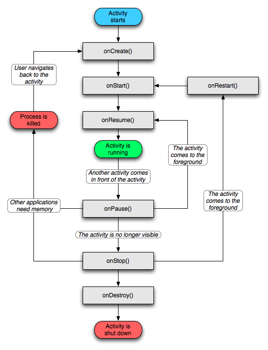

# webNapp QnA

👻 <br>
안드로이드와 웹을 공부하면서 궁금한 것들을 정리합니다.

- recent updates : date

---
## 목차

### 1. 안드로이드 📱

  
  <details>
    <summary> 
        Activity / Context 
    </summary>
  
  * Activity
    - __정의__ <br>
    _사용자에게 UI가 있는 화면을 제공_ 하는 앱 컴포넌트. <br><br>
    각 액티비티는 다른 액티비티를 실행할 수 있고, <br>
    새로운 액티비티가 시작되면 시스템은 '백스택'에 담고, 사용자에게 보여준다. <br>
    백스택은 '스택(LIFO)' 매커니즘을 따르며, 사용자가 뒤로가기 버튼을 누를 경우, <br>
    스택의 최상위(top)에 있는 현재 액티비티를 제거(pop and destroy)하고 이전의 액티비티를 시작한다.
    
    - Activity 생명주기(LifeCycle)

    

      - `OnCreate()` <br>
      이 콜백은 시스템이 먼저 활동을 생성할 때 실행되는 것으로, 필수적으로 구현해야 한다. <br>
      활동이 생성되면 생성됨 상태가 된다. onCreate() 메서드에서 활동의 전체 수명 주기 동안 한 번만 발생해야 하는 기본 애플리케이션 시작 로직을 실행한다. <br>
      예를 들어 onCreate()를 구현하면 데이터를 목록에 바인딩하고, 활동을 ViewModel과 연결하고, 일부 클래스 범위 변수를 인스턴스화할 수도 있다.<br>
      이 메서드는 savedInstanceState 매개변수를 수신하는데, 이는 활동의 이전 저장 상태가 포함된 Bundle 객체다.<br>
      이번에 처음 생성된 활동인 경우 Bundle 객체의 값은 null이다.<br>

        ```java

        String str;

        @Override
        public void onCreate(Bundle savedInstanceState) {
            super.onCreate(savedInstanceState);

            // 인스턴스 상태 복구
            if (savedInstanceState != null) {
                str = savedInstanceState.getString(STATE_KEY);
            }

            setContentView(R.layout.main_activity);

            ...
        }
        ```
        onCreate() 메서드가 실행을 완료하면 시작됨 상태가 되고, 시스템이 연달아 onStart()와 onResume() 메서드를 호출한다.<br><br>

      - `OnStart()` <br>
      활동이 시작됨 상태에 들어가면 시스템은 이 콜백을 한다.<br>
      onStart()가 호출되면 활동이 사용자에게 표시되고, 이 메서드에서 앱이 UI를 관리하는 코드를 초기화한다.<br><br>
      onStart() 메서드는 매우 빠르게 완료되고, 생성됨 상태와 마찬가지로 활동은 시작됨 상태에 머무르지 않는다.<br>
      이 콜백이 완료되면 활동이 재개됨 상태에 들어가고, 시스템이 onResume() 메서드를 호출한다.<br><br>

      - `OnResume()` <br>
      활동이 재개됨 상태에 들어가면 포그라운드에 표시되고 시스템이 onResume() 콜백을 호출한다.<br>
      이 상태에 들어갔을 때 앱이 사용자와 상호작용한다. 어떤 이벤트가 발생하여 앱에서 포커스가 떠날 때까지 앱이 이 상태에 머무른다.<br> 예를 들어 전화가 오거나, 사용자가 다른 활동으로 이동하거나, 기기 화면이 꺼지는 이벤트가 이에 해당한다.<br><br>
      방해되는 이벤트가 발생하면 활동은 일시중지됨 상태에 들어가고, 시스템이 onPause() 콜백을 호출한다.<br><br>

      - `OnPause()` <br>
      시스템은 사용자가 활동을 떠나는 것을 나타내는 첫 번째 신호로 이 메서드를 호출한다.(하지만 해당 활동이 항상 소멸되는 것은 아님)<br> 활동이 포그라운드에 있지 않게 되었다는 것을 나타낸다(다만 사용자가 멀티 윈도우 모드에 있을 경우에는 여전히 표시 될 수도 있음).<br><br>
      onPause() 메서드의 실행이 완료되더라도 활동이 일시중지됨 상태로 남아 있을 수 있다.<br> 오히려 활동은 다시 시작되거나 사용자에게 완전히 보이지 않게 될 때까지 이 상태에 머무른다.<br>
      활동이 다시 시작되면 시스템은 다시 한번 onResume() 콜백을 호출한다. <br>
      활동이 일시중지됨 상태에서 재개됨 상태로 돌아오면 시스템은 Activity 인스턴스를 메모리에 남겨두고, 시스템이 onResume()을 호출할 때 인스턴스를 다시 호출한다. 이 시나리오에서는 최상위 상태가 재개됨 상태인 콜백 메서드 중에 생성된 구성요소는 다시 초기화할 필요가 없다. 활동이 완전히 보이지 않게 되면 시스템은 onStop()을 호출한다. 
      
      - `OnStop()` <br>
      활동이 사용자에게 더 이상 표시되지 않으면 중단됨 상태에 들어가고, 시스템은 onStop() 콜백을 호출한다. <br>
      이는 예를 들어 새로 시작된 활동이 화면 전체를 차지할 경우에 적용된다. 시스템은 활동의 실행이 완료되어 종료될 시점에 onStop()을 호출할 수도 있다.<br><br>
      onPause() 대신 onStop()을 사용하면 사용자가 멀티 윈도우 모드에서 활동을 보고 있더라도 UI 관련 작업이 계속 진행됩니다.<br>
      또한 onStop()을 사용하여 CPU를 비교적 많이 소모하는 종료 작업을 실행해야 한다. 예를 들어 정보를 데이터베이스에 저장할 적절한 시기를 찾지 못했다면 onStop() 상태일 때 저장할 수 있다.<br><br>
      활동은 정지됨 상태에서 다시 시작되어 사용자와 상호작용하거나, 실행을 종료하고 사라진다.<br>
      활동이 다시 시작되면 시스템은 onRestart()를 호출한다. Activity가 실행을 종료하면 시스템은 onDestroy()를 호출한다. 

      - `OnDestory()` <br>
      onDestroy()는 활동이 소멸되기 전에 호출된다. 시스템은 다음 중 하나에 해당할 때 이 콜백을 호출한다.<br>

        1) (사용자가 활동을 완전히 닫거나 활동에서 finish()가 호출되어) 활동이 종료되는 경우
        2) 구성 변경(예: 기기 회전 또는 멀티 윈도우 모드)으로 인해 시스템이 일시적으로 활동을 소멸시키는 경우<br>
      활동이 종료되는 경우 onDestroy()는 활동이 수신하는 마지막 수명 주기 콜백이 된다.<br>
      구성 변경으로 인해 onDestroy()가 호출되는 경우 시스템이 즉시 새 활동 인스턴스를 생성한 다음, 새로운 구성에서 그 새로운 인스턴스에 관해 onCreate()를 호출한다.<br><br>
      onDestroy() 콜백은 이전의 콜백에서 아직 해제되지 않은 모든 리소스(예: onStop())를 해제해야 한다.<br><br>  

  * Context
    - 정의 : 새로 생성된 객체가 지금 어떤 일이 일어나고 있는지 알 수 있도록 한다. 따라서 액티비티와 애플리케이션에 대한 정보를 얻기 위해서는 컨텍스트를 사용하면 된다.
    
  <br>  
  
  [Top of page](#목차)
  </details>

  <details>
    <summary> 
        AsyncTask 
    </summary>
  
  [Top of page](#목차)
  </details>
 
  <details>
    <summary> 
        Background 
    </summary>

    * thread
    * handler
    * message
    * messageQueue
    * looper
    * runnable

  [Top of page](#목차)
  </details>
  
  <details>
    <summary> 
        Connection 
    </summary>

    * URLConnection
    * HttpsURLConnection
    * TrustManager
  
  [Top of page](#목차)
  </details>

  <details>
    <summary> 
        Input output 
    </summary>

    * InputStream 
    * InputStreamReader
  
  [Top of page](#목차)
  </details>
    
    
  <details>
    <summary> 
        Inflater 
    </summary>
  
  [Top of page](#목차)
  </details>
    
  <details>
    <summary> 
        Listener 
    </summary>
  
  [Top of page](#목차)
  </details>
    
  <details>
    <summary> 
        WebView 
    </summary>

    * WebView 
    * Drawer
    
  [Top of page](#목차)
  </details>

  <details>
    <summary> 
        SharedPreference 
    </summary>
  
  [Top of page](#목차)
  </details>
    
  <details>
    <summary> 
        etc 
    </summary>

    * ArrayList<HashMap>
    * static 
    * Callback
    * OncreateOptionsMenu
    * singleton
    * MVC
    * JSONParse
    * NavigationView
    
  [Top of page](#목차)
  </details>
    
---

### 2. 웹  🖥

  <details>
    <summary> 
        통신 
    </summary>
  
  [Top of page](#목차)
  </details>


